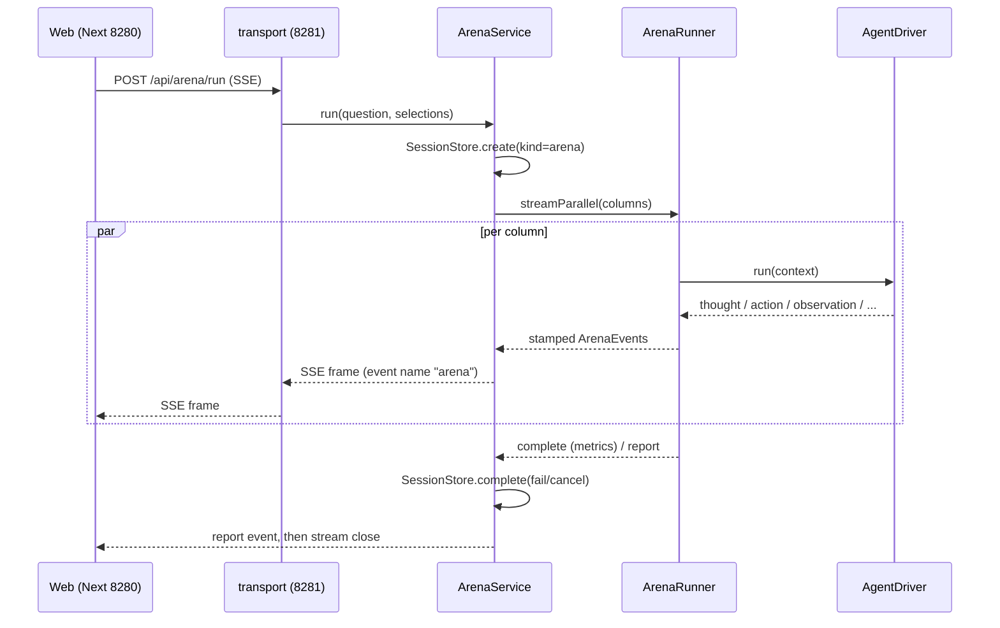

# Data flow

End-to-end paths for the three execution surfaces: an Arena run, a Matrix run, and a
Builder turn. Every hop cites the owning package.

## One Arena request

```
Web (apps/web) ──► Next rewrite /api/* → 127.0.0.1:8281 (apps/web/next.config.ts)
  ──► transport: CORS → body-size precheck → API-token auth (packages/transport/http-runtime)
  ──► route-arena: POST /api/arena/run, zod-validated ArenaRunRequest, streamSSE("arena")
  ──► application: ArenaService.run() opens a session of kind "arena" and books by eventsYielded
  ──► arena-runner: ArenaRunner.streamParallel()
        · Semaphore caps concurrency at MAX_CONCURRENT_RUNS, default 4
        · CircuitBreaker per endpoint, primitive owned by runtime
        · per-column worker → driver lookup through DriverLookup → AgentDriver.run()
  ──► agent: runAgentExecution, harness context pipeline, toolset selection,
        sandbox deny policy, subagent and ralph_loop nesting, event stamping
  ──► driver: LLM stream, LangChain model built by provider-langchain
  ──► ArenaEvent SSE frames travel back up the same chain, and the web folds them via @agentprism/arena-view
```

Sequencing rules pinned in code:

- `stream.onAbort` on the route aborts an `AbortController` whose signal reaches the
  runner. A client abort books the session as `cancelled`, and abort wins over failure.
  See `packages/transport/route-arena/src/arena.ts` and contracts `SessionStatus`.
- In-stream exceptions are emitted as an `error` event with `pipeline: "system"` on the
  same SSE channel, so the stream never dies silently.
- Session booking goes through the `SessionService` use-case layer wrapped in
  `safeSession`. Ledger pathologies warn and never interrupt the run.



## Judging and matrices

- `POST /api/arena/judge` runs `judgeAnswers(answers, judgeSpec)` from
  `@agentprism/evaluation`. The deterministic judge types are `keyword`, `json`, `code`,
  `numeric`, `exclude`, `regex`, and `none`.
- `buildComparisonReport` assembles per-column reports: metrics, artifacts, hard
  metrics, one LLM narrative call, and optional ablation rows.
- `POST /api/arena/matrix` on SSE channel `"matrix"` executes 1 to 8 template cells
  sequentially through `ArenaService` and emits `matrix_progress` and a final
  `matrix_report`. Per-cell failures stay isolated.
- `scripts/run-matrix.mjs` reads `GET /api/arena/templates` for scored templates and
  drives that endpoint from the CLI.

## One Builder turn

```
POST /api/builder/sessions/:id/chat (SSE channel "builder", zod-validated,
  message ≤ BUILDER_MESSAGE_MAX_CHARS = 12 000, attachments ≤ 5)
  ──► BuilderService (builder-service): session store, catalog, hot-swap through PATCH
  ──► runBuilderTurn (builder-turns): driver execution, composition blocks, trace log
  ──► ledger: each turn opens a "builder" session and books through the SessionService port
```

Builder SSE chunks are a discriminated union on `stream`:

- `trace`, a `BuilderTraceEntry` with kind `llm_request`, `llm_response`, `llm_error`,
  `session`, `swap`, or `notice`
- `event`, a full `ArenaEvent`
- `turn`, a `BuilderTurnMeta` with turn, runId, answer, metrics, and workspace
- `error`, with `message` and `fatal`

The stream always terminates with a `[DONE]` data frame unless the client disconnected.
See `packages/transport/route-builder/src/builder.ts`.

Every trace entry, arena event, and turn marker is also appended uncut to the session's
JSONL journal under `data/builder_traces/<sessionId>.jsonl`. `SessionTraceStore` writes
it with debounced fail-open flushes. `GET /api/builder/sessions/:id` returns the journal
as `records`, so the execution trail persists across restarts and accumulates across
turns. The frontend renders it as the accumulated timeline.

## Frontend folding

`@agentprism/arena-view` is the pure event-stream to view-projection module: column
state, trace folding, final-answer extraction, and report rendering. Final-answer
extraction reads the last thought, or else the last observation. `apps/web` depends only
on `client`, `ui`, and `arena-view`. The SSE proxy in `next.config.ts` sets
`compress: false` because Next gzip buffering would hold the event stream until the run
completes.

## Where state lands on disk

| Path | Content | Owner |
|---|---|---|
| `data/sessions.json` and `.bak` | session ledger document `{version:1, sessions:[…]}` | `FileSessionStore` |
| `data/sessions.json.blobs/` | oversized ledger entry texts named `<sessionId>.<seq>.blob.txt` | `FileBlobStore` |
| `data/provider_config.json` and `.bak` | provider endpoints; keys may be `${env:NAME}` references | `ProviderConfigStore` |
| `data/builder_sessions.json` and `.bak` | builder session store | `BuilderSessionStore` |
| `data/builder_traces/<sessionId>.jsonl` | per-session observability journal with trace entries, arena events, and turn markers | `SessionTraceStore` |
| `data/projects.json` | archived projects | `ProjectStore` |
| `data/memory_episodic.json` and `data/memory_semantic.json` | cross-session memory stores | `EpisodicMemory`, `SemanticMemory` |
| `data/runtime_knobs.json` | file-backed runtime knob overrides | `RuntimeKnobsStore` |
| `data/runs/<runId>/<workspace>/` | per-column scratch workspaces, rehydrated after restart | `WorkspaceRegistry` |
| `…/.spills/` | oversized tool-result and job output dumps | `tool-builtins` spill helper |

All writes are atomic through `@agentprism/persistence`: a `.tmp` file, a rename, and
`.bak` recovery.
