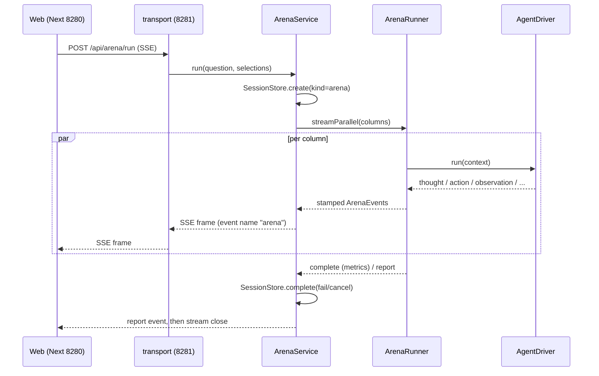

# 数据流

> 语言：**简体中文** | [English](data-flow.md)

三个执行暴露面的端到端路径：一次 Arena run、一次 Matrix run、一次 Builder
turn。每一跳都标注其所属 package。

## 一次 Arena 请求

```
Web (apps/web) ──► Next rewrite /api/* → 127.0.0.1:8281 (apps/web/next.config.ts)
  ──► transport: CORS → body-size precheck → API-token auth (packages/transport/http-runtime)
  ──► route-arena: POST /api/arena/run, zod-validated ArenaRunRequest, streamSSE("arena")
  ──► application: ArenaService.run() opens a session of kind "arena" and books by eventsYielded
  ──► arena-runner: ArenaRunner.streamParallel()
        · Semaphore caps concurrency at MAX_CONCURRENT_RUNS, default 4
        · CircuitBreaker per endpoint, primitive owned by runtime
        · per-column worker → driver lookup through DriverLookup → AgentDriver.run()
  ──► agent: runAgentExecution, harness context pipeline, toolset selection,
        sandbox deny policy, subagent and ralph_loop nesting, event stamping
  ──► driver: LLM stream, LangChain model built by provider-langchain
  ──► ArenaEvent SSE frames travel back up the same chain, and the web folds them via @agentprism/arena-view
```

代码中固定的时序规则：

- 路由上的 `stream.onAbort` 中止一个 `AbortController`，其 signal 抵达 runner。
  客户端 abort 把 session 记为 `cancelled`，且 abort 优先于 failure。
  见 `packages/transport/route-arena/src/arena.ts` 与 contracts `SessionStatus`。
- 流内异常作为 `error` event 发出，`pipeline: "system"`，在同一 SSE 通道上，
  因此流绝不静默死亡。
- Session 记账经 `SessionService` 用例层，并包在 `safeSession` 中。
  账本病态只告警，绝不打断 run。



## Judging 与矩阵

- `POST /api/arena/judge` 运行 `judgeAnswers(answers, judgeSpec)`，来自
  `@agentprism/evaluation`。确定性 judge 类型为 `keyword`、`json`、`code`、
  `numeric`、`exclude`、`regex`、`none`。
- `buildComparisonReport` 装配每列 report：metrics、artifacts、hard metrics、
  一次 LLM 叙述调用、可选 ablation 行。
- `POST /api/arena/matrix` 在 SSE 通道 `"matrix"` 上经 `ArenaService` 顺序执行
  1 至 8 个 template cell，发出 `matrix_progress` 与最终 `matrix_report`。
  每 cell 失败相互隔离。
- `scripts/run-matrix.mjs` 读取 `GET /api/arena/templates` 的 scored 模板，
  并从 CLI 驱动该 endpoint。

## 一次 Builder turn

```
POST /api/builder/sessions/:id/chat (SSE channel "builder", zod-validated,
  message ≤ BUILDER_MESSAGE_MAX_CHARS = 12 000, attachments ≤ 5)
  ──► BuilderService (builder-service): session store, catalog, hot-swap through PATCH
  ──► runBuilderTurn (builder-turns): driver execution, composition blocks, trace log
  ──► ledger: each turn opens a "builder" session and books through the SessionService port
```

Builder SSE chunk 是按 `stream` 判别的联合类型：

- `trace`，即 `BuilderTraceEntry`，kind 为 `llm_request`、`llm_response`、`llm_error`、
  `session`、`swap`、`notice`
- `event`，即完整的 `ArenaEvent`
- `turn`，即 `BuilderTurnMeta`，含 turn、runId、answer、metrics、workspace
- `error`，含 `message` 与 `fatal`

流总以 `[DONE]` data frame 终止，除非客户端断开。
见 `packages/transport/route-builder/src/builder.ts`。

每条 trace 条目、arena event 与 turn 标记也完整追加到该 session 在
`data/builder_traces/<sessionId>.jsonl` 下的 JSONL 日志。`SessionTraceStore` 以
带防抖的 fail-open flush 写入。`GET /api/builder/sessions/:id` 把该日志作为
`records` 返回，因此执行轨迹跨重启持久、跨 turn 累积。前端将其渲染为
累积时间线。

## 前端折叠

`@agentprism/arena-view` 是纯 event-stream 到 view-projection 模块：column
state、trace folding、final-answer extraction、report 渲染。final-answer
extraction 读取最后一条 thought，否则最后一条 observation。`apps/web` 只依赖
`client`、`ui`、`arena-view`。`next.config.ts` 中的 SSE proxy 设置
`compress: false`，因为 Next 的 gzip 缓冲会把 event 流保持到 run 完成。

## 状态最终落在磁盘的哪里

| 路径 | 内容 | 归属 |
|---|---|---|
| `data/sessions.json` 与 `.bak` | session 账本文档 `{version:1, sessions:[…]}` | `FileSessionStore` |
| `data/sessions.json.blobs/` | 超大账本条目文本，命名为 `<sessionId>.<seq>.blob.txt` | `FileBlobStore` |
| `data/provider_config.json` 与 `.bak` | provider endpoints；key 可为 `${env:NAME}` 引用 | `ProviderConfigStore` |
| `data/builder_sessions.json` 与 `.bak` | builder session store | `BuilderSessionStore` |
| `data/builder_traces/<sessionId>.jsonl` | 每 session 可观测日志，含 trace 条目、arena event、turn 标记 | `SessionTraceStore` |
| `data/projects.json` | 归档的 projects | `ProjectStore` |
| `data/memory_episodic.json` 与 `data/memory_semantic.json` | 跨 session 记忆 store | `EpisodicMemory`、`SemanticMemory` |
| `data/runtime_knobs.json` | 文件级 runtime knob 覆盖 | `RuntimeKnobsStore` |
| `data/runs/<runId>/<workspace>/` | 每列临时 workspace，重启后重水化 | `WorkspaceRegistry` |
| `…/.spills/` | 超大 tool 结果与 job 输出 dump | `tool-builtins` spill helper |

所有写入经 `@agentprism/persistence` 原子化：`.tmp` 文件、rename、`.bak` 恢复。
